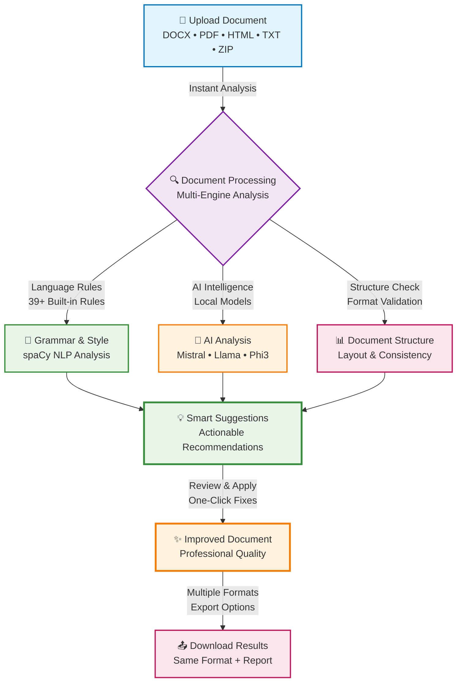

# 🏠 Welcome to DocScanner

Your intelligent writing assistant that helps create better documents while keeping your data completely private and secure.

---

## 🤖 AI-Powered Writing Assistant

DocScanner is like having a professional editor that works for you 24/7. It analyzes your documents and suggests improvements to make your writing clearer, more professional, and easier to read.

---

## � What Makes DocScanner Different

**Complete Privacy** - Everything stays on your computer, no cloud processing  
**Universal Support** - Works with any document format  
**Always Available** - Functions offline after initial setup  
**Smart Analysis** - AI-powered suggestions for clearer writing

---

## � Interactive DocScanner Workflow

Experience how DocScanner transforms your documents through our intelligent analysis process:

### 🎯 Explore Each Step

<h4>📄 Document Upload</h4>

Support for DOCX, PDF, HTML, TXT, and ZIP formats with drag-and-drop simplicity

<a href="/features/#multi-format" class="md-button md-button--primary">Learn About Formats →</a>

<h4>🔍 Intelligent Processing</h4>

Advanced AI models analyze grammar, style, and document structure locally on your computer

<a href="/technology/" class="md-button md-button--primary">See Technology →</a>

<h4>💡 Smart Suggestions</h4>

Get actionable recommendations with confidence scores and one-click improvements

<a href="/usage/" class="md-button md-button--primary">View Usage Guide →</a>

<h4>✨ Results & Benefits</h4>

40-60% faster editing with 96% accuracy in grammar detection and style consistency

<a href="/performance-measures/" class="md-button md-button--primary">See Performance →</a>

---

## 🚀 Ready to Transform Your Writing?

<a href="/how-to-use/" class="md-button md-button--primary md-button--lg" style="margin: 0 10px 10px 0;">🎯 Start Your Journey</a>

<a href="/benefits/" class="md-button md-button--lg" style="margin: 0 10px 10px 0;">💡 See All Benefits</a>

<a href="/faq/" class="md-button md-button--lg" style="margin: 0 10px 10px 0;">❓ Have Questions?</a>

