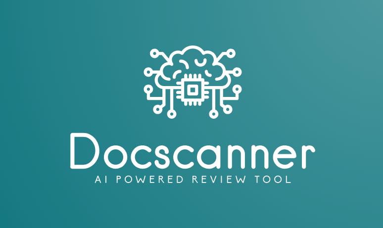

# DocScanner – RAG based AI Review Tool

<section id="hero" style="text-align:center; padding:50px; background:linear-gradient(to right,#1a8a8a,#256d85); color:white;">
  
  <h1>Welcome to Docscanner</h1>
  

    AI-powered document review tool designed for technical writers.  
    Analyze your documentation with style rules, LLMs, and RAG for faster, consistent, and clearer writing.
  

  <a href="https://your-flask-app-url.com" style="display:inline-block; margin-top:20px; padding:12px 25px; background:white; color:#256d85; border-radius:6px; text-decoration:none; font-weight:bold;">
    🚀 Get Started
  </a>
</section>

---

## 🚀 Main Aim

- **Save Time:** Automate repetitive checks in documentation.  
- **Ensure Consistency:** Maintain style and terminology standards.  
- **Boost Quality:** Provide AI-powered suggestions to enhance readability.

---

## 👥 Who Can Benefit?

  

    <h3>Technical Writers</h3>
    
Get automated feedback and suggestions to write faster and better.

  

  

    <h3>Documentation Teams</h3>
    
Maintain consistency across manuals and documentation sets.

  

  

    <h3>QA & Product Teams</h3>
    
Quickly review documentation quality and compliance with guidelines.

  

---

## ⚙️ How It Works

### 1. Upload Documents
- Upload files or connect to your repository.

### 2. Rule-Based Analysis
- Predefined style, grammar, and terminology rules are applied.

### 3. AI Suggestions
- RAG + LLM provides context-aware improvements.

### 4. Export & Feedback
- Review suggested corrections and export improved content.

---

## 📌 Get Started

  <a href="https://your-flask-app-link.com" class="btn-primary">🚀 Try DocScanner</a>
  <a href="usage.md" class="btn-secondary">📖 View Documentation</a>

