# 🏠 Welcome to DocScanner

Your intelligent writing assistant that helps create better documents while keeping your data completely private and secure.

---

## 🤖 AI-Powered Writing Assistant

DocScanner is like having a professional editor that works for you 24/7. It analyzes your documents and suggests improvements to make your writing clearer, more professional, and easier to read.

---

## 🔍 What Makes DocScanner Different

**Complete Privacy** - Everything stays on your computer, no cloud processing  
**Universal Support** - Works with any document format  
**Always Available** - Functions offline after initial setup  
**Smart Analysis** - AI-powered suggestions for clearer writing

---

## 🤖 RAG-Based DocScanner Workflow

```mermaid
flowchart TD
    A["📝 Ask a Question"] --> B["🤔 Understand the Question<br/>(Turn into search form)"]
    B --> C["🔍 Retrieve Helpful Info<br/>(Search the knowledge base)"]
    C --> D["📂 Select the Best Bits<br/>(Most relevant info)"]
    D --> E["🔗 Merge with the Question"]
    E --> F["💡 Generate the Answer<br/>(AI writes the reply)"]
    F --> G["📢 Deliver Answer to the User"]
```

<h3 style="color: #333333 !important; margin: 0; text-shadow: none;">🔍 AI-Powered Document Analysis</h3>

---

## 🚀 Ready to Transform Your Writing?

<a href="/how-to-use/" class="md-button md-button--primary md-button--lg" style="margin: 0 10px 10px 0;">🎯 Start Your Journey</a>

<a href="/benefits/" class="md-button md-button--lg" style="margin: 0 10px 10px 0;">💡 See All Benefits</a>

<a href="/faq/" class="md-button md-button--lg" style="margin: 0 10px 10px 0;">❓ Have Questions?</a>

