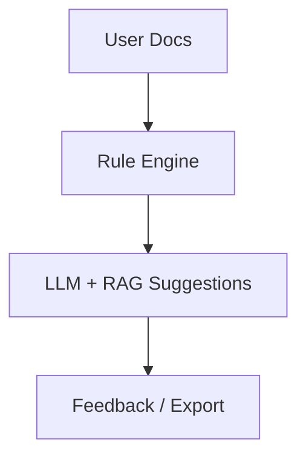

# Technology behind DocScanner

DocScanner AI combines traditional rule-based systems with modern AI to help technical writers efficiently review content. It now runs entirely on your machine, ensuring privacy, speed, and cost-efficiency while staying focused on writing quality.

## Methodology

* Rule-Based Configuration

* Enforces style, grammar, and terminology rules.

* Allows customization according to your organization’s standards.

### RAG + LLM

Context-aware AI suggestions using Retrieval-Augmented Generation.

Provides suggestions grounded in your existing documentation.

Powered by a local AI stack for secure, cost-free, and fast inference.

## What Powers DocScanner AI

✅ Local LLM Processing – Runs TinyLLaMA locally via Ollama.

🔒 Complete Privacy – No data leaves your machine.

⚡ Fast Responses – Local inference eliminates latency.

💰 Zero Costs – No recurring API fees.

📚 Smart Context – Vector search with ChromaDB retrieves the right rules and documentation.

🎯 Writing Focus – Optimized specifically for DocScanner rules and technical writing.

## Tech Stack

* LLM Runtime: Ollama + TinyLLaMA

* Vector Storage: ChromaDB

* RAG Framework: LlamaIndex

* Backend: Python, Flask

* NLP & Rules: spaCy, Custom Rule Engine

* Frontend / Docs: MkDocs with Material theme

### Workflow diagram

