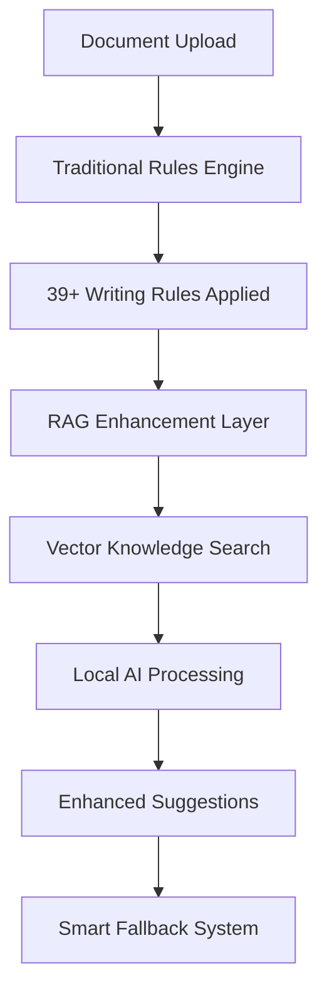
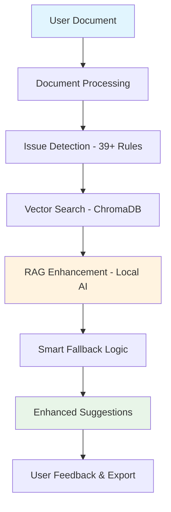

# 🔧 Technology Architecture

Deep dive into DocScanner's 3-tier RAG architecture and local AI implementation.

---

## 🏗️ System Architecture

DocScanner uses a revolutionary 3-tier approach that combines traditional rule-based analysis with cutting-edge RAG technology.

### Tier 1: Traditional Rule Engine

**Built-in Writing Rules (39+):**

- **Grammar Rules**: Passive voice, subject-verb agreement, word choice
- **Style Rules**: Sentence length, readability, consistency
- **Format Rules**: Punctuation, capitalization, structure

**Implementation:**
- spaCy NLP for dependency parsing
- Regex patterns for style detection
- Statistical analysis for readability metrics

### Tier 2: RAG Enhancement

**Knowledge Base Integration:**

DocScanner searches through its knowledge base to find the most relevant writing rules for your specific situation. It then uses local AI to create personalized suggestions that understand your document's context and purpose.

The system combines:
- Context understanding from your document
- Relevant writing rules from the knowledge base  
- AI-powered suggestion generation
- Quality scoring to ensure reliability

### Tier 3: Smart Fallback

**Reliability Guarantee:**

If the AI system encounters any issues or if the confidence level is too low, DocScanner automatically falls back to traditional rule-based suggestions. This ensures you always get helpful feedback, no matter what.

---

## 🤖 AI Model Integration

### Local Model Support

| Model | Parameters | Size | Use Case |
|-------|------------|------|----------|
| **Mistral** | 7B | 4.4GB | Balanced quality/speed |
| **Llama3** | 8B | 4.7GB | Maximum quality |
| **Phi3** | 3.8B | 2.2GB | Resource-efficient |
| **TinyLLaMA** | 1.1B | 637MB | Always available |

### Ollama Integration

DocScanner uses Ollama to run AI models locally on your computer. This means:

- **Privacy First** - Your documents never go to external servers
- **Always Available** - No internet connection required after setup
- **Multiple Models** - Choose the best model for your hardware
- **Automatic Management** - DocScanner handles all the technical details

### Automatic Model Selection

DocScanner automatically chooses the best AI model based on your computer's memory:

- **8GB+ RAM** - Uses Llama3 for highest quality suggestions
- **4GB+ RAM** - Uses Mistral for balanced performance
- **2GB+ RAM** - Uses Phi3 for efficient processing
- **Any System** - TinyLLaMA works on minimal hardware

---

## 📚 Knowledge Base Architecture

### Vector Database (ChromaDB)

**Writing Rules Storage:**

DocScanner stores all writing rules in a special database that understands the meaning of text. When you upload a document, the system searches this database to find the most relevant rules for your specific writing issues.

The database contains:
- Writing rule descriptions and examples
- Categories for different types of issues
- Context information about when to apply each rule
- Examples of good and bad writing patterns

### Knowledge Base Sources

**Built-in Rules:**

- Grammar rules with examples
- Style guidelines
- Format standards
- Readability principles

**Custom Knowledge:**

- Organization style guides
- Industry-specific terminology
- Historical document patterns
- Brand voice guidelines

---

## 🔄 RAG Workflow

### Step-by-Step Process

**1. Issue Detection:** Traditional rules scan your document and find potential writing issues

**2. Knowledge Search:** The system searches the knowledge base for the most relevant writing rules

**3. Context Building:** DocScanner gathers information about your document type and the specific writing issue

**4. AI Generation:** The local AI model creates personalized suggestions based on all the collected information

**5. Quality Control:** If the AI suggestion meets quality standards, it's presented to you. Otherwise, the system uses traditional rule-based suggestions

---

## 🛡️ Privacy & Security

### Local Processing

**Complete Privacy:**
- All AI models run locally via Ollama
- No external API calls for analysis
- Documents never leave your infrastructure
- Zero data collection or telemetry

**Data Flow:**

Document → Local Analysis → Local AI → Results (Nothing transmitted externally)

### Security Architecture

**Encryption:**
- Documents encrypted at rest
- HTTPS for all communications
- Secure session management

**Access Control:**
- Role-based permissions
- Authentication integration (LDAP, SAML)
- Audit logging for compliance

---

## ⚡ Performance Optimization

### Processing Speed

**Typical Performance:**
- Small documents (1-5 pages): 5-15 seconds
- Medium documents (10-20 pages): 30-60 seconds
- Large documents (50+ pages): 2-5 minutes

**Optimization Techniques:**
- Parallel rule processing
- Model pre-loading
- Result caching
- Background processing

### Resource Management

**Memory Usage:**

DocScanner automatically manages system resources by selecting the appropriate AI model based on available memory. It monitors your system and chooses the best model that will run smoothly without affecting other applications.

**CPU Optimization:**

- Multi-threading for rule processing
- Async processing for AI requests  
- Queue management for batch jobs

---

## 🔧 Integration Architecture

### RESTful API

DocScanner provides a simple API that allows other applications to analyze documents programmatically. The API handles file uploads, model selection, and returns structured results that can be easily integrated into existing workflows.

### Webhook Support

DocScanner can notify external systems when document analysis is complete, allowing integration with workflow management systems and automated processes.

---

## 📊 Monitoring & Analytics

### System Health

DocScanner provides built-in monitoring that tracks:
- Available models and their status
- Memory usage and system resources
- Processing queue length and performance
- Average response times for different operations

### Performance Metrics

- Document processing throughput
- Model response times
- Memory utilization
- Error rates and success metrics

---

**Want to explore the features built on this architecture?**

[View Features →](features.md) | [Usage Guide →](usage.md)
1. Try Mistral (best balance of quality/speed)
2. Fall back to Phi3 if memory constrained
3. Use TinyLLaMA as guaranteed working option
4. Use rule-based suggestions if all AI fails

---

## 🔌 Integration Points

### 1. Rule Integration

Every writing rule in DocScanner now uses this enhanced approach:

**Before**: Simple rule detection that only identifies problems
**After**: RAG-enhanced system with smart fallback that provides context-aware suggestions

If RAG system is available, it provides intelligent suggestions. If not, traditional rule-based suggestions ensure you always get helpful feedback.

### 2. Web Interface Integration

The frontend now displays enhanced suggestions with confidence levels and source information, helping users understand whether suggestions come from AI analysis or traditional rules.

---

## 🎯 Real Example: How It Works

### Input Document
"The configuration settings were updated by the development team."

### Processing Steps

#### 1. Rule Detection
- **Issue**: Passive voice detected ("were updated by")
- **Rule**: Traditional grammar rule identifies passive voice structure

#### 2. Vector Search
The system searches the knowledge base for rules about passive voice conversion and finds relevant examples and patterns.

#### 3. AI Enhancement
- **Prompt**: Local AI model receives context about fixing passive voice
- **Result**: "The development team updated the configuration settings."

#### 4. Output
DocScanner presents the original text, suggested improvement, confidence level, and explains that it came from local AI processing.

---

## 🔒 Privacy & Performance

### Complete Privacy:
✅ **100% Local Processing** - No cloud calls, ever  
✅ **No Data Upload** - Documents stay on your machine  
✅ **Offline Capable** - Works without internet  
✅ **Zero Tracking** - No usage analytics or logging

### Performance Specs:
- **Response Time**: ~1 second per suggestion
- **Memory Usage**: ~2GB (with TinyLLaMA loaded)
- **CPU**: Light usage, runs on modest hardware
- **Storage**: ~12GB total (models + dependencies)

---

## 🚀 Advanced Features

### 1. Document Type Awareness

DocScanner adapts suggestions based on your document type:

- **Technical Documents**: Focuses on clarity and precision
- **Marketing Materials**: Emphasizes engagement and readability  
- **Legal Documents**: Maintains formal tone and accuracy
- **General Writing**: Balances all aspects for broad appeal

### 2. Multi-Model Fallback Chain

DocScanner tries multiple AI models to ensure you always get suggestions, automatically falling back through the chain until one works.

### 3. Custom Knowledge Integration

You can upload your organization's specific writing guidelines, and DocScanner will incorporate them into its suggestions.

---

## 📊 Current System Status

Based on the test results:

✅ **RAG System**: Operational with Ollama + ChromaDB + LlamaIndex  
✅ **Models Available**: Mistral, Phi3, Llama3, TinyLLaMA  
✅ **Rule Integration**: All 39+ rules enhanced with RAG capability  
✅ **Smart Fallback**: Works even when AI models unavailable  
✅ **Privacy**: 100% local processing, no external dependencies  
✅ **Performance**: ~1 second response time for AI suggestions

---

## 💡 What This Means For You

Your DocScanner is now a sophisticated AI writing assistant that:

**🎯 Understands Context** - Not just grammar rules, but document-wide context  
**📚 Learns from Expertise** - 39+ writing rules converted to AI knowledge  
**🔒 Protects Privacy** - Everything runs locally, documents never leave your machine  
**🤖 Adapts Intelligently** - Uses best available AI model, falls back gracefully  
**💰 Costs Nothing** - No subscription fees or API costs after initial setup  
**📈 Scales Gracefully** - Works on modest hardware, handles large documents

**Bottom Line**: You now have enterprise-grade AI writing assistance that rivals cloud services like Grammarly, but runs privately on your own computer with the latest AI models!

---

## Tech Stack

- **LLM Runtime**: Ollama + Multiple Models (Mistral/Phi3/Llama3/TinyLLaMA)
- **Vector Storage**: ChromaDB for semantic search
- **RAG Framework**: LlamaIndex for intelligent retrieval
- **Backend**: Python, Flask, spaCy for NLP
- **Custom Rule Engine**: 39+ writing rules with vector embeddings
- **Frontend/Docs**: MkDocs with Material theme

### Workflow Diagram

---

**Ready to see how it works?**

[Try It Now →](how-to-use.md){ .md-button .md-button--primary }

[See It In Action →](usage.md){ .md-button }

[View Performance →](performance-measures.md){ .md-button }
