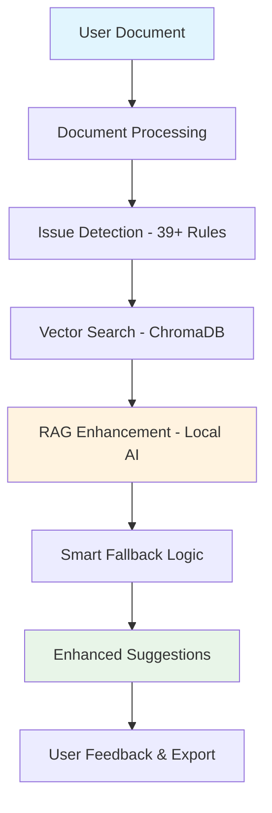

# 🔧 How DocScanner Works

Understand the technology behind DocScanner and how it delivers intelligent writing assistance while keeping your data completely private.

---

## 🖥️ Local Processing Architecture

All analysis happens on your computer using a 3-tier architecture: traditional rule processing, vector search with ChromaDB, and local AI models via Ollama.

---

## 🤖 AI Models Available

Choose from **Mistral** (4.4GB - best balance), **Llama3** (4.7GB - highest quality), **Phi3** (2.2GB - fast processing), or **TinyLLaMA** (637MB - resource-efficient).

---

## 📋 39+ Built-in Rules

Advanced rule engine checks grammar, style, readability, and structure using spaCy NLP for dependency parsing and linguistic analysis.

---

## 🔍 Vector Search Enhancement

ChromaDB-powered semantic search finds relevant context from your knowledge base to enhance AI suggestions with domain-specific improvements.

---

## 🔒 Complete Privacy Protection

Documents never leave your system. All AI models run locally via Ollama with no internet connection required and zero external data transmission.

---

## ⚡ Performance Specifications

**Small documents** (1-5 pages): 5-15 seconds. **Large documents** (25-50 pages): 2-5 minutes. Parallel processing with memory-efficient operations.

---

## 🎛️ Model Management

Built-in model selector with automatic system resource detection. Easy switching between AI models based on your hardware capabilities and quality needs.

---

## 🔄 Smart Fallback Logic

If AI models aren't available, DocScanner gracefully falls back to traditional rules, ensuring you always get helpful feedback regardless of system constraints.

---

## 🛠️ System Integration

RESTful API for programmatic access, webhook support for workflow automation, and compatibility with existing documentation pipelines.

---

## 📈 Adaptive Processing

Automatic system resource management with CPU optimization, multi-threading for rule processing, and async handling for smooth performance.

---

---

**Ready to see how it works?**

[Try It Now →](how-to-use.md){ .md-button .md-button--primary }

[See It In Action →](usage.md){ .md-button }

[View Performance →](performance-measures.md){ .md-button }
