# How DocScanner works?

```mermaid
flowchart TD
  A["� Upload Document"] --> B["🛠 Text Extraction<br/>(PDF, MD, DOCX, HTML, ZIP)"]
  B --> C["🧹 Text Parsing & Cleaning"]
  C --> D["� Rule-Based Checks<br/>(Style Guide, Grammar, Readability)"]
  C --> E
  subgraph RAG["🔥 RAG (Retrieval-Augmented Generation)"]
    E["🧠 Embedding Generation"]
    E --> F["💾 Store in ChromaDB<br/>+ Knowledge Base"]
    F --> G["🤖 AI Suggestions & Feedback"]
  end
  D --> G
  G --> H["📑 Report Generation"]
```

<h3 style="color: #333333 !important; margin: 0; text-shadow: none;">🗂️ Complete Document Processing Pipeline</h3>

---

**Ready to start using DocScanner?**

  <a href="/features/" class="md-button md-button--primary">Advanced Features →</a>
  <a href="/technology/" class="md-button">Technical Details →</a>
  <a href="/faq/" class="md-button">Get Help →</a>

